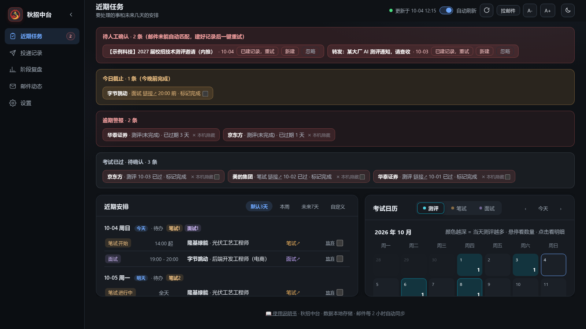
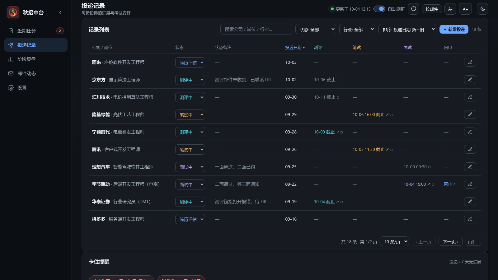
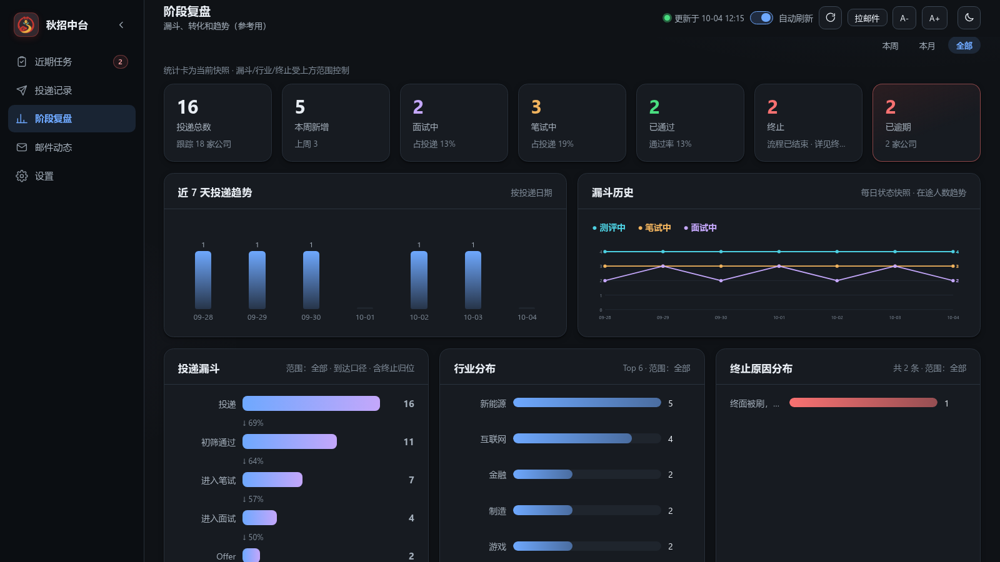
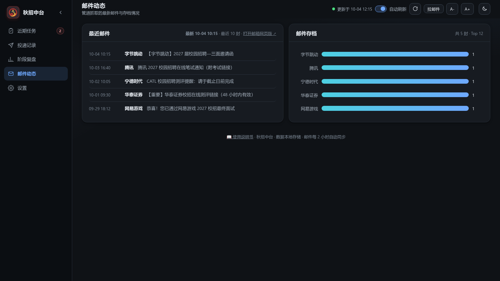
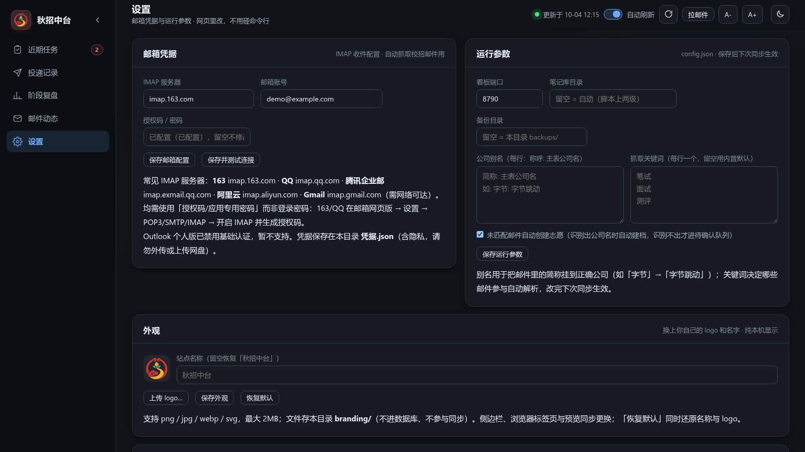

# 秋招中台 · 使用说明书

> 版本 1.1 · 2026-10-04 ｜ 适合人群：不需要懂任何编程技术的同学
> 一句话介绍：把你的求职邮件自动整理成一张实时看板——投了哪些公司、走到哪一步、接下来要考什么试，一目了然。

---

## 一、它能帮你做什么

- **自动收邮件**：每隔 2 小时自动读取你的邮箱，把笔试/面试/测评/Offer 等通知自动归类
- **自动建档案**：每投一家公司建一条"志愿"，进展全自动更新（简历评估 → 测评 → 笔试 → 面试 → 结果）
- **考试日历**：所有考试安排自动进日历，快到期的提前提醒，不会错过截止时间
- **外观随心换**：看板的 logo 和名字可以在「设置」页换成你自己的图片和名称
- **数据全在本地**：所有数据存在你自己的电脑里，不上传任何服务器
- **不用记命令**：所有操作都在网页里点点点完成

## 二、第一次使用（5 步，约 5 分钟）

### 第 1 步：解压
把收到的压缩包解压到任意文件夹（建议放桌面，好找）。解压后能看到"启动中台.bat"这个文件。

### 第 2 步：双击"启动中台.bat"
- 双击后会弹出一个黑色窗口——**这是正常的**，它是看板的"发动机"，保持开着就行（关掉它看板就停了）
- 第一次双击，Windows 可能弹蓝色提示"已保护你的电脑"：点"更多信息"→"仍要运行"
- **不需要安装任何东西**：压缩包里自带了 Python 运行环境

### 第 3 步：浏览器自动打开
几秒后浏览器会自动打开看板页面。没打开的话，手动在浏览器输入 `127.0.0.1:8790` 回车即可。

### 第 4 步：绑定你的邮箱（可跳过，只需做一次）
1. 首次使用会自动跳到"**设置**"页（左侧栏最下面一个齿轮图标）；顶部横幅也可以选"**② 先手动用（免邮箱）**"——先不绑邮箱，直接手动记录投递，之后随时再绑
2. 填三样东西：
   - **IMAP 服务器**：163 填 `imap.163.com`；QQ 填 `imap.qq.com`（其他邮箱见第五节）
   - **邮箱账号**：你的邮箱地址
   - **授权码**：不是邮箱登录密码！是"授权码"，获取方法见第五节
3. 点"**保存并测试连接**"——先自动保存再测试（一键完成），看到绿色"连接成功"就完成了

### 第 5 步：录入你的投递记录
1. 左侧栏点"**投递记录**"→ 点右上角"**＋ 新增投递**"
2. 填公司名称（必填，要和邮件里对公司称呼一致）、岗位名称、行业 → 保存
3. 之后该公司的所有邮件就自动挂到这条记录上了

> 完成后，邮箱里符合条件的新邮件每 2 小时自动进来。想立刻收一次：点看板**右上角的「拉邮件」按钮**，一般几秒到一两分钟就能看到结果（不用命令行）。

## 三、四个页面分别是干什么的

| 页面 | 用途 |
|---|---|
| **近期任务** | 今天/未来几天要做什么：快截止的测评、要参加的笔试面试、卡住没消息的投递。**每天先看这页** |
| **投递记录** | 你的全部志愿清单：新增、改状态、补备注、按公司/状态筛选。展开某行还能看到它名下的考试安排 |
| **阶段复盘** | 统计图表：投递漏斗（几层筛掉了多少人）、行业分布、趋势——阶段总结时看 |
| **邮件动态** | 系统最近抓到了哪些邮件、每家公司攒了多少封，确认"邮件管道是否正常" |

### 近期任务页（每天先看这里：截止提醒 / 逾期警报 / 考试日历）

### 投递记录页（点"＋ 新增投递"建志愿；点行首箭头展开考试安排）

### 阶段复盘页（漏斗 / 行业分布 / 趋势，阶段总结时看）

### 邮件动态页（确认邮件抓取是否正常）

### 设置页（邮箱凭据、运行参数与外观，全程图形化）

设置页最下方的「**外观**」区可以自定义看板：点"上传 logo…"选一张你喜欢的图片（支持 png / jpg / webp / svg，最大 2MB），"站点名称"里填你想显示的名字（留空恢复默认"秋招中台"），保存后侧边栏、浏览器标签页会同步更换；点"恢复默认"一键还原。

## 四、收到"待人工确认"横幅怎么办（以及自动建档说明）

**好消息：大多数邮件已经不需要你处理了。** 收到"感谢投递/测评/笔试/面试"类邮件时，如果看板里还没有这家公司，系统会**自动创建志愿**（识别方式：邮件主题里的【公司名】、发件人显示名或发件人域名），建档后邮件自动归档、考试自动排期——你在"投递记录"页看到新公司出现，补一下岗位/行业即可。广告/群发邮件不会自动建档，可在设置页关闭"自动创建志愿"开关。

**宣讲会/招聘会邮件不会建档**（宣讲会不算投递），它们会进入顶部横幅由你决定。仍需人工处理的邮件也会进横幅：

1. **点一下横幅里的条目** → 弹出详情：发件人是谁、正文写了什么、里面有什么链接
2. 三种处理方式（详情浮层里都有一点）：
   - **新建志愿**：底部有公司名输入框（已预填系统识别出的名字，可修改）→ 点"创建并入库"——适合宣讲会、没建过档的邮件
   - **已建记录，重试**：你已经在"投递记录"页手动建了该公司 → 点它，邮件立即挂上去
   - **忽略**：广告/无关邮件，以后不再提醒
3. 横幅处理完会自动消失

## 五、授权码怎么获取（重点！）

**授权码 ≠ 邮箱密码。** 它是邮箱官方提供的"第三方应用专用密码"。

### 163 邮箱
1. 电脑浏览器登录 mail.163.com → 顶部"设置"→"POP3/SMTP/IMAP"
2. 开启"IMAP/SMTP 服务"→ 按提示用手机发短信 → 得到一串**授权码**
3. 把授权码填进看板"设置"页，服务器填 `imap.163.com`

### QQ 邮箱
1. 登录 mail.qq.com → "设置"→"账号"→ 找到"POP3/IMAP/SMTP…"服务 → 开启"IMAP/SMTP 服务"
2. 按提示用手机发短信生成**授权码**（16 位字母）
3. 服务器填 `imap.qq.com`

### 腾讯企业邮
登录 exmail.qq.com → 设置 → 客户端专用密码，服务器填 `imap.exmail.qq.com`。

> Gmail 需要网络环境支持且要用"应用专用密码"；Outlook 个人版官方已关闭此登录方式，暂不支持。

## 六、考试和面试怎么管理

- **自动的**：邮件里写了时间/截止日的考试，自动出现在"近期任务"的日历里
- **手动补一场**（比如电话约的面试）：投递记录页 → 展开该公司那一行 → 在"考试安排"区选类型、填时间 → 保存
- **改期**：点那场考试旁的编辑，直接改时间
- **考完了**：勾选"完成"✓（当天还会显示，第二天自动归档）
- **不想参加了**：标"放弃"（和"完成"互斥，随时可撤销）
- **状态错了**：在投递记录里点状态标签，手动改成 7 种状态之一

## 七、数据存在哪 / 怎么备份搬家

| 你关心的 | 答案 |
|---|---|
| 数据在哪 | 全部在本文件夹的 `中台.sqlite` 一个文件里 |
| 怎么备份 | 每 2 小时同步时自动备份一份（默认保留最近 30 份）；也可直接复制 `中台.sqlite` |
| 换电脑 | 拷贝整个文件夹 + `中台.sqlite`，到新电脑双击启动即可 |
| 想重新开始 | 关闭看板 → 删除 `中台.sqlite`（想清楚，记录全没了）→ 重新录入 |

> 隐私提醒：`凭据.json`（邮箱授权码）和 `中台.sqlite`（全部投递数据）**不要发给别人、不要传网盘**。

## 八、常见问题

**Q1：双击后黑窗口一闪就没了 / 没有任何反应？**
多半是安全拦截：① Windows 弹蓝色"已保护你的电脑"→ 点"更多信息"→"仍要运行"；② 杀毒软件把启动器拦了 → 把本文件夹加入白名单重试；③ 先确认压缩包**已完整解压**（直接在压缩包里双击会弹提示，需要先解压）。

**Q2：浏览器没自动打开？**
手动打开浏览器，输入 `127.0.0.1:8790`。还是不行：看黑窗口里最后一行——若提示端口被占用，按提示改 config.json 里的端口即可（窗口里有中文步骤）。

**Q3：测试连接失败？**
① 授权码填的是登录密码（最常见！）→ 改用授权码；② 邮箱没开 IMAP 服务 → 按第五节开启；③ 开了代理 → 先关代理再测。

**Q4：明明有面试邮件，看板里没有？**
去"邮件动态"页看是否抓到了；抓到了但没匹配上 → 顶部横幅会等你处理；公司名对不上 → 把投递记录里的公司名改成和邮件称呼一致，或在设置页加"公司别名"（如 `字节: 字节跳动`）。

**Q5：某封邮件我不想让它进系统？**
横幅里点"忽略"即可，之后不再提醒。

**Q6：时间/状态自动填错了？**
所有字段都能手动改：投递记录里直接改状态和备注；考试行可改期/删除。系统只在你没填的空位上自动填，不会覆盖你手填的内容。

**Q7：公司名建错了怎么删？**
投递记录 → 点行首箭头展开 → 拉到底部"**删除此志愿**"→ 确认后会连同它名下的考试安排和邮件存档一起删掉（不可恢复）。注意：只是暂时没进展的话，建议把状态改成"终止"而不是删除。

**Q8：怎么彻底停掉它？**
关掉黑色窗口，或双击 `停止中台.bat`。

**Q9：电脑重启后要重新打开吗？**
看板不会自动常驻。重启后双击"启动中台.bat"即可（之前的数据都在）。

**Q10：能多人一起用一个看板吗？**
设计为单人单机使用。数据无账号隔离，不建议共用。

**Q11：想换掉左上角的 logo 和"秋招中台"这个名字？**
"设置"页最下方「外观」区：上传自己的图片（png / jpg / webp / svg，≤2MB）、填写站点名称，点"保存外观"即可；"恢复默认"一键还原。

**Q12：升级新版本怎么办？**
保留你的 `中台.sqlite`、`凭据.json`、`config.json` 三个文件，其余文件用新版覆盖即可。

## 九、安全与隐私

- 看板只在本机（127.0.0.1）运行，局域网里其他设备**看不到**你的数据
- 授权码、邮件数据都只存在本机文件里；程序不会上传任何内容到外部服务器
- 唯一外联：按固定频率去你的**邮箱**读邮件（只读，不会动你的邮件）

## 十、给别人推荐

直接把你的安装包（zip）转发给对方即可——包里**不含**你的任何数据和密码，对方解压后按本说明书第二节"第一次使用"操作即可。

---

*遇到说明书没覆盖的问题：请把黑色窗口里的报错文字截图，找部署这个工具给你的同学即可。*
